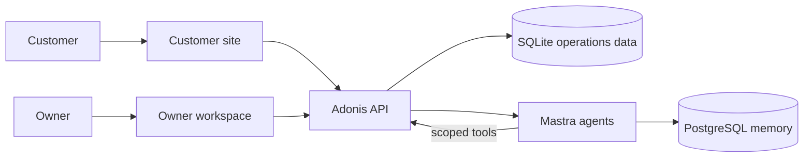

# Oak - supervised operations for service businesses

Oak is a working prototype of a supervised AI back office for owner-operated service businesses. It
handles routine customer work, keeps the owner informed, and stops at decisions that should still
belong to a person.

Oak & Pine, a fictional San Francisco home-services company, is the end-to-end example in this
repository. The product includes the customer website where work begins and the private workspace
where the owner supervises it.

## What this project is proving

Most support software gives an owner another inbox to work through. Most agent demos hide the work
after a prompt is submitted. Oak tests a different operating model:

- The agent is the default handler for routine questions, booking lookup, and preparation.
- The owner sees customer work organized by responsibility and outcome, not just message recency.
- Authority is explicit. New bookings wait for owner confirmation. A reschedule requires business
  authorization and the customer's final consent before the calendar changes.
- Completed work, failed work, and work waiting on a person remain visible in the same operational
  record.

The result is not a general-purpose chatbot or a conventional CRM. It is an exploration of how a
small service business can delegate customer operations without giving up control of its
commitments.

## The product loop

1. A customer starts a conversation on the Oak & Pine website.
2. Oak answers from known business context and uses booking tools only for a verified customer.
3. Routine work continues without owner involvement.
4. Work that crosses an authority, judgment, relationship, or failure boundary appears in the
   owner's Inbox.
5. The owner supplies the missing decision, and Oak completes the workflow or returns it to the
   customer for consent.
6. The conversation records the actual outcome, including incomplete or failed actions.

The current build includes public support, email-based customer verification, durable
conversations, customer and booking records, pending booking creation, dual-consent rescheduling,
an operational Inbox, an owner overview, an activity feed, and an owner-facing assistant called
Ask Oak.

## Run it locally

You need [Bun 1.4](https://bun.sh/), Docker, and an OpenAI API key. A Resend API key is also needed
to exercise customer email verification; public support and the owner workspace can run without
one.

```bash
bun install --frozen-lockfile
cp apps/api/.env.example apps/api/.env
cp apps/agent/.env.example apps/agent/.env
```

Add `OPENAI_API_KEY` to `apps/agent/.env`. Keep `MASTRA_INTERNAL_TOKEN` identical in the API and
agent environment files. To test verified-customer flows, also add `RESEND_API_KEY` to
`apps/api/.env` and set `MAIL_FROM_ADDRESS` to a sender authorized by that Resend account.

Initialize the application and start the full development stack:

```bash
bun run key:generate
bun run db:migrate
bun run db:seed
bun run dev
```

`bun run dev` starts the Mastra PostgreSQL database in Docker and runs all four application
services with live reload:

| URL                                     | Surface                           |
| --------------------------------------- | --------------------------------- |
| [localhost:3000](http://localhost:3000) | Owner workspace                   |
| [localhost:3100](http://localhost:3100) | Customer website and support chat |
| [localhost:3333](http://localhost:3333) | Adonis API                        |
| [localhost:4111](http://localhost:4111) | Mastra Studio                     |

Sign in to the owner workspace with the seeded account:

```text
Email: kim@oakandpine.test
Password: password123
```

The seed also creates representative customers and bookings. Conversations created on the customer
site then appear in the owner Inbox, so the two surfaces can be exercised as one workflow rather
than as separate demos.

Press `Ctrl+C` to stop the application processes. The database container runs in the background;
stop it when you are finished with:

```bash
bun run agent:db:stop
```

## How it is built

Adonis is the system boundary. It owns sessions, customer identity, operational state, booking
rules, and the short-lived capabilities granted to agent tools. The browser and model never choose
an arbitrary customer or receive direct write access to the booking database.



The repository is a Bun workspace:

- `apps/app` — Next.js owner workspace
- `apps/demo` — Next.js Oak & Pine customer site
- `apps/api` — Adonis API and authoritative operations layer
- `apps/agent` — Mastra customer-support and owner-operations agents
- `packages/better-sqlite3` — the Lucid-compatible adapter backed by Bun's native SQLite driver
- `docs` — product and architecture notes for the approval and Inbox workflows

The current scope is deliberately narrow: one owner-operator, one example business, one customer
channel, and local demo data. Team routing, multiple businesses, payments, omnichannel messaging,
and policy administration are not implemented.

## Development commands

Run repository-wide checks from the root:

```bash
bun run lint
bun run typecheck
bun run test
bun run build
```

Run the agent regression suite with:

```bash
bun run evals
```

For agent-only development, evaluation details, background processes, and logs, see the
[agent runbook](apps/agent/RUNBOOK.md).
