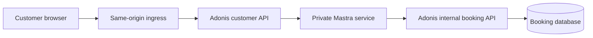

# Customer-approved booking rescheduling

## Runtime topology

The browser talks only to the customer-facing Adonis resources through the same-origin `/api`
ingress. The Next.js rewrite is a development convenience and is disabled in production; the
production ingress must route `/api` to Adonis directly.

Mastra is a private service protected by `MASTRA_INTERNAL_TOKEN`. Only Adonis owns customer
sessions, conversation-to-customer authorization, approval decisions, and booking capabilities.
The booking database remains authoritative for the consent card and for all mutation rules.

## Resource boundaries

- `POST /api/v1/demo/session` is the only demo-specific identity adapter. It chooses the fixed
  Alice fixture server-side and stores her customer ID in an encrypted session.
- `/api/v1/support/conversations` owns the durable mapping between a customer and a Mastra thread.
- `/api/v1/support/conversations/:id/messages` accepts one new customer message and streams the
  native Mastra response.
- `/api/v1/support/conversations/:id/approval-request` scopes suspended runs to the conversation
  and customer, then derives service, staff, and current time from the booking database.
- `/api/v1/support/conversations/:id/approval-decisions` finds the scoped pending call itself. The
  browser never submits a run ID, tool-call ID, customer ID, or booking capability.
- `/api/v1/agent/booking-searches` accepts only a short-lived read capability.
- `/api/v1/agent/booking-reschedules` accepts only an exact reschedule capability and delegates the
  mutation to `reschedule-booking.ts`.

## Consent and authority

Normal chat receives `find_bookings` authority only. The `reschedule_booking` tool suspends before
execution with three arguments: `booking_id`, `expected_start_time`, and `new_start_time`.

After an explicit approval request, Adonis reloads the booking, verifies that the request is still
current and in the future, and mints a five-minute capability bound to:

- customer ID
- booking ID
- expected and proposed start times
- Mastra run and tool-call IDs

The booking action checks the expected start again inside a transaction. This makes a replay or a
stale approval fail closed. It also checks interval overlap using both bookings' durations.

Declining needs no write capability. Any composer reply while a card is pending is sent as a
decline reason—even the word “yes”—so corrections can guide the agent toward a new proposal without
executing the old one.

## Recovery

Mastra memory stores messages by `threadId` and customer `resourceId`. Suspended runs are queried by
both values. On refresh the browser reloads messages and the pending request through Adonis; it does
not restore either from local storage. If a decision stream is interrupted, the browser performs the
same reconciliation read.

## Deployment requirements

- Route production `/api` traffic directly to Adonis at the ingress.
- Do not expose Mastra or Studio publicly.
- Set the same high-entropy `MASTRA_INTERNAL_TOKEN` for Adonis and Mastra.
- Set `CUSTOMER_APP_ORIGIN` to the public customer application origin.
- Use a shared Adonis session store when running more than one API instance.
